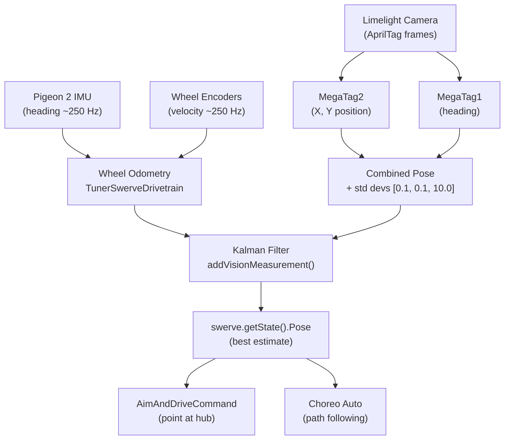

# Overview

Wayne HS 10411 Rufus 

[Google Doc Notes](https://docs.google.com/document/d/1e-II6_diUCd73_c5pIJWgDAT_IvrZXD0227dueINiO4/edit) <-- Log what you do here


# 2026CompetitiveConcept

This repository contains the code used for the WestCoast Products 2026 [Competitive Concept](https://wcproducts.com/pages/wcp-competitive-concepts).

The project is based on one of CTRE's [Phoenix 6 example projects](https://github.com/CrossTheRoadElec/Phoenix6-Examples/tree/main/java/SwerveWithChoreo). It uses WPILib [command-based programming](https://docs.wpilib.org/en/stable/docs/software/commandbased/what-is-command-based.html) to manage robot subsystems and actions, a [Limelight](https://limelightvision.io/) for vision, and [Choreo](https://choreo.autos/) for autonomous path following.

## Driver Controls (Xbox Controller — port 0)

### Driving
| Input | Action |
|---|---|
| Left Stick | Translate |
| Right Stick X | Rotate |
| A | Lock heading toward opponent alliance wall (180°) |
| B | Lock heading right (90° clockwise) |
| X | Lock heading left (90° counter-clockwise) |
| Y | Lock heading toward own alliance wall (0°) |
| Back | Re-zero field-centric orientation to current robot heading |

> **Field Centric toggle:** A **"Field Centric"** boolean in Elastic (SmartDashboard key `Field Centric`) switches drive mode. Default is **on** (field-centric). When turned off, the robot drives relative to its own front — useful for precise close-range maneuvers. Heading-lock (A/B/X/Y) is only active in field-centric mode.

### Shooting
| Input | Action |
|---|---|
| Right Trigger | Auto-aim at hub using Limelight, spin up shooter, feed when aimed and ready |
| Right Bumper | Spin up shooter to dashboard RPM (default 5000), feed once above 3500 RPM |

> **Right Trigger vs Right Bumper:** Right trigger requires a valid Limelight target lock before feeding. Right bumper shoots without vision — use this when the Limelight has no target or for close shots.

### Intake
| Input | Action |
|---|---|
| Left Trigger | Deploy intake pivot and run rollers (hold to intake) |
| Left Bumper | Stow intake pivot |
| Start | Chase visible fuel — steer toward largest fuel cluster using Limelight + run intake (hold) |

### Climbing
| Input | Action |
|---|---|
| D-Pad Up | Raise hanger to pre-hang position |
| D-Pad Down | Pull hanger down to fully climbed position |

### Troubleshooting
| Input | Action |
|---|---|
| D-Pad Left | Reverse floor and shooter to clear a jam (hold) |
| Right Stick Click | Toggle force field on/off |

---

## Force Field Library (git subtree)

The `refinery-forcefield/` directory is a **git subtree** of the [BioNanomics/refinery-forcefield](https://github.com/BioNanomics/refinery-forcefield) library. It provides wall repulsion, snap-to zones, and a visual preset editor. The Gradle composite build (`includeBuild`) resolves the library at compile time — no JAR publishing or version management needed.

See [refinery-forcefield/README.md](refinery-forcefield/README.md) for charge types, tuning, and the web editor.

### Updating the library

```bash
./scripts/update-forcefield.sh
```

This runs `git subtree pull` to merge the latest upstream changes into this repo.

### Pushing changes back upstream

If you edit files inside `refinery-forcefield/` directly in this repo and want to push them back to the library:

```bash
git subtree push --prefix=refinery-forcefield forcefield main
```

### First-time setup (after a fresh clone)

New clones need to add the `forcefield` remote:

```bash
git remote add forcefield https://github.com/BioNanomics/refinery-forcefield.git
```

The subtree files are already committed in the repo — no submodule init required.

---

## MCP Server (AI Assistant Integration)

The robot includes an embedded MCP server that exposes read-only robot state (battery, match info, CAN bus health, NetworkTables) to AI assistants like GitHub Copilot and Claude. It is **on by default** and can be toggled off from the **"MCP Server"** switch on the Shuffleboard **Robot** tab.

See [MCP.md](MCP.md) for full setup instructions (VS Code, Claude Desktop, curl testing, available tools).

---

## Field Setup & Match Calibration

Complete these steps **at every new event** (and after any camera or robot mechanical changes) before going on the field.

### 1. Upload the AprilTag Field Map to the Limelight

> Do this once per event — not before every match.

1. Connect a laptop to the robot's network (robot on, roboRIO booted).
2. Open the Limelight web UI: **http://limelight.local:5801** (or **http://10.104.11.11:5801** if mDNS isn't working).
3. Go to **Settings → AprilTag Field Map**.
4. Upload the correct JSON from the [`limelight-config/`](limelight-config/) folder:
   - **Most events (district, regional):** `2026-rebuilt-welded.json`
   - **If the event specifies AndyMark field parts:** `2026-rebuilt-andymark.json`
5. Confirm the active pipeline is set to **AprilTag** mode.

### 2. Set Up the Fuel Detector Pipeline

> Do this **once** (new camera, new season, or reflash). Not required before every event.

The robot uses two Limelight pipelines:

| Pipeline index | Type | Purpose |
|---|---|---|
| **0** | AprilTag | Field-relative pose estimation (localization) |
| **1** | Neural Detector | Fuel game-piece detection for the Start-button chase command |

#### 2a. Update Limelight OS to 2026.0+

The 2026 Hailo model flow requires **Limelight OS 2026.0 or newer**. Check the firmware version in the web UI under **Settings → System**. If it is older, download the latest image from the [Limelight downloads page](https://docs.limelightvision.io/docs/resources/downloads) and reflash.

#### 2b. Download the Fuel model and labels

From the [Limelight downloads page](https://docs.limelightvision.io/docs/resources/downloads), download:

- **Fuel B1 Model — HAILO 8 MONOCHROME** (or **HAILO 8L MONOCHROME** — match the accelerator in your unit)
- **Fuel Labels**

#### 2c. Create pipeline 1 as a Neural Detector

1. In the Limelight web UI, click **+** to add a new pipeline (or select slot 1 if it already exists).
2. Set **Pipeline Type** to **Neural Detector**.
3. Upload the model file and the labels file you downloaded.
4. Set the **Runtime** to **Hailo 8** or **Hailo 8L** to match your hardware.
5. Set **Confidence Threshold** to **0.55** as a starting point (lower finds more pieces; higher reduces false positives).

#### 2d. Set a crop window

Crop out regions that can never contain fuel to reduce false positives and improve speed:
- Bottom of frame: your own bumper/intake
- Top of frame: ceiling, bleachers, alliance wall

Drag the crop handles in the Neural Detector pipeline editor to exclude these areas.

#### 2e. Verify the pipeline index

With the robot running, confirm in the web UI that:
- **Pipeline 0** is your AprilTag pipeline (the robot uses this by default and returns to it after chasing).
- **Pipeline 1** is the Neural Detector / Fuel pipeline.

Robot code switches between them automatically — pipeline 0 is active at all times except while the driver holds **Start**.

#### 2f. Camera exposure for moving game pieces

In the Neural Detector pipeline camera settings:
- Use **low exposure** to reduce motion blur on rolling fuel.
- Raise **gain** just enough to keep detections stable in the venue lighting.
- You are not trying to produce a clear video — stable detections during robot motion are the goal.

### 3. Verify Camera Pose (Robot-to-Camera Transform)

The Limelight needs to know where it is mounted on the robot to produce accurate field-relative pose estimates.

1. In the Limelight web UI, go to **Settings → Robot Offset** (or the 3D tab depending on firmware version).
2. Enter the camera's position and angle relative to the center of the robot:
   - **Forward (X):** distance the camera is in front of robot center (meters, positive = forward)
   - **Side (Y):** distance left/right of robot center (meters, positive = left)
   - **Up (Z):** height above the floor (meters)
   - **Roll / Pitch / Yaw:** camera tilt angles (degrees)
3. Measure these from the robot physically if they haven't been set — they must match the actual mount.

### 4. Re-Zero Field-Centric Orientation Before Each Match

At the start of every match (robot placed on the field):

1. Point the **front of the robot** toward the driver station wall (or align as required by your starting position).
2. Press **Back** on the Xbox controller to re-zero field-centric orientation to the robot's current heading.

> The robot uses field-centric driving relative to this zero, so this must match how the robot is physically placed.

### 5. Verify Vision Is Working (Pre-Match Check)

1. Open **Shuffleboard** or **AdvantageScope** while connected to the robot.
2. Confirm vision data is updating:
   - **Shuffleboard:** check `SmartDashboard/limelight/Estimated Robot Pose`
   - **AdvantageScope (live or from log):** check `/AdvantageKit/Limelight/EstimatedPose` and `/AdvantageKit/Limelight/MeasurementAccepted`
3. If the pose is wildly wrong or not updating:
   - Check that the Limelight has a tag in view (run a test with tags visible).
   - Re-confirm the field map was uploaded and the correct pipeline is active.
   - Check that the camera pose offset is configured correctly.

### 6. Shooter Tuning (If Needed)

- The target shooter RPM for manual shots (Right Bumper) is set via **Shuffleboard** — look for the `Target RPM` slider under the Shooter subsystem widget.
- Default is **5000 RPM**. Adjust based on shot distance for the event venue.
- Feed threshold is fixed at **3500 RPM** — the floor and feeder will not run until the shooter crosses this.

---

## Power-Up Initialization

When the robot is powered on and robot code starts, several automatic initialization steps occur before the robot is ready to operate. Understanding this sequence helps diagnose issues and know what to expect when enabling the robot.

> **If you change any of this behavior in code, update this section.**
> Links back here are in the relevant source files:
> - `RobotContainer.java` — `configureBindings()` (homing trigger)
> - `Intake.java` — `homingCommand()`
> - `Hanger.java` — `homingCommand()`

### 1. On Code Start (Robot Constructor)

These happen immediately when the robot code launches, before any mode is active:

| What | Detail |
|---|---|
| AdvantageKit logging | Starts writing `.wpilog` to `/home/lvuser/logs/` and publishing live via NT4 |
| Brownout protection | RoboRIO brownout threshold set to **6.1 V** |
| Subsystems initialized | All subsystems (Swerve, Intake, Floor, Feeder, Shooter, Hood, Hanger, Limelight) are instantiated and their motors configured |
| Vision update begins | Limelight default command starts running immediately, even while disabled (`ignoringDisable = true`) |
| Shooter default command | Shooter default is `stop()` — motors hold at zero until commanded |
| MCP server toggle | A Shuffleboard boolean on the Robot tab; on by default. See [MCP.md](MCP.md) |

### 2. On First Enable (Teleop or Autonomous — not Test Mode)

When the robot transitions into **teleop or autonomous** for the first time after power-up, two homing sequences run automatically and in parallel. They are suppressed in **test mode**.

#### Intake Pivot Homing

The intake pivot motor has no absolute encoder, so its zero position must be found by driving it to a physical hard stop.

1. Pivot motor drives **outward at 10% output** (toward the hard stop).
2. Code waits until **supply current exceeds 6 A** — this indicates the pivot has stalled against the hard stop.
3. Encoder is **zeroed** at the hard stop position (`HOMED` = 110°).
4. Pivot immediately moves to **`STOWED` position (100°)**.

> This command uses `kCancelIncoming` — it cannot be interrupted once started. A subsequent position command will be queued until homing finishes.

#### Hanger Homing

The hanger motor also uses a hard-stop current-sensing approach.

1. Hanger motor drives **inward (retract) at −5% output**.
2. Code waits until **supply current exceeds 0.4 A** — indicating the hanger has bottomed out.
3. Encoder is **zeroed** at the retracted position (`HOMED` = 0 inches extension).
4. Hanger immediately extends to the **`EXTEND_HOPPER` position (2 inches)** — clear of the robot chassis.

> This command uses `kCancelSelf` — any position command issued during homing will cancel the homing sequence.

### 3. Field-Centric Drive Zero

The swerve drive uses field-centric control relative to a stored heading. This heading is **not automatically reset on power-up** — it must be manually re-zeroed by the driver before each match using the **Back button** on the Xbox controller (see [Re-Zero Field-Centric Orientation](#3-re-zero-field-centric-orientation-before-each-match)).

> `seedFieldCentric()` is suppressed in test mode to avoid affecting other test sequences.
---

## How the Robot Knows Its Position on the Field

Rufus maintains a continuous field-relative pose (X, Y, heading) by fusing two sources: **wheel odometry** and **Limelight vision**. These are merged via a Kalman filter built into CTRE's `SwerveDrivetrain` base class.

### 1. Wheel Odometry (always running)

The CTRE [`TunerSwerveDrivetrain`](src/main/java/frc/robot/generated/TunerConstants.java) tracks the robot's position by integrating wheel encoder velocities and gyroscope (Pigeon 2 IMU) heading at a high rate (~250 Hz). This is reliable over short distances but accumulates drift over time.

The current estimated pose is available at any time via `swerve.getState().Pose`. It is used throughout the robot — for example, [`AimAndDriveCommand`](src/main/java/frc/robot/commands/AimAndDriveCommand.java) uses it to compute the angle from the robot to the hub on every cycle.

### 2. Limelight AprilTag Vision (fused continuously)

The [`Limelight`](src/main/java/frc/robot/subsystems/Limelight.java) subsystem reads AprilTag detections from the camera and returns a field-relative pose estimate using **MegaTag2** (position) and **MegaTag1** (heading):

| Source | Used for | Why |
|---|---|---|
| MegaTag2 | X / Y translation | More position-stable; uses IMU heading to resolve tag ambiguity |
| MegaTag1 | Rotation (heading) | Helps counteract IMU drift over a match |

The combined pose is published in two places every cycle:
- `SmartDashboard/limelight/Estimated Robot Pose` — for Shuffleboard diagnostics
- `/AdvantageKit/Limelight/EstimatedPose` — in the `.wpilog` for post-match replay in AdvantageScope

Additional signals logged to `/AdvantageKit/Limelight/`: `TagCount`, `LatencyMs`, `AvgTagDistMeters`, `MeasurementAccepted` (false when no tags visible).

Standard deviations passed with each vision measurement are `[0.1 m, 0.1 m, 10.0 rad]` — the filter trusts X/Y position strongly but is skeptical of heading from vision, since the gyro is generally more reliable for rotation.

### 3. Kalman Filter Fusion

[`RobotContainer.updateVisionCommand()`](src/main/java/frc/robot/RobotContainer.java#L141) runs as the Limelight's default command on **every periodic cycle, even while disabled** (`ignoringDisable = true`). Each cycle it:

1. Gets the current best pose from the swerve state.
2. Sends it to the Limelight (so MegaTag2 can use the IMU heading for tag disambiguation).
3. If a valid pose estimate is returned (at least one tag visible), calls [`swerve.addVisionMeasurement()`](src/main/java/frc/robot/subsystems/Swerve.java#L149) to feed the fix into the Kalman filter with its standard deviations.

The filter automatically weights odometry vs. vision based on the respective standard deviations. If no tags are visible, the robot continues relying on odometry alone.

### 4. How It Is Used

- **Auto-aim ([`AimAndDriveCommand`](src/main/java/frc/robot/commands/AimAndDriveCommand.java)):** Computes the direction from `swerve.getState().Pose` to `Landmarks.hubPosition()` and rotates the robot to point its shooter at the hub.
- **Autonomous ([`AutoRoutines`](src/main/java/frc/robot/commands/AutoRoutines.java)):** Choreo path following uses the fused pose to run PID corrections in [`Swerve.followPath()`](src/main/java/frc/robot/subsystems/Swerve.java#L98), keeping the robot on the planned trajectory.
- **Diagnostics:** The live estimated pose and all subsystem state is visible in AdvantageScope at `/AdvantageKit/…` whenever connected to the robot or when replaying a `.wpilog` log file. Swerve pose (`Swerve/Pose`) and vision (`Limelight/EstimatedPose`) are both captured in the log for full post-match replay.



---

## Autonomous Routines

The active auto routine is selected in **Elastic** before the match using the **Auto Chooser** widget. The robot runs the selected routine automatically when autonomous mode starts.

### Setting Up the Auto Chooser Widget in Elastic

> Do this once after first connecting to the robot with Elastic. The layout is saved and reloads automatically on future connections.

1. **Connect** your laptop to the robot network and open **Elastic**.
2. **Enable editing** — click the pencil / edit icon in Elastic's toolbar.
3. **Add a new widget** — click **+** (Add Widget) or drag from the widget palette.
4. Choose **ComboBox Chooser** (or **Split Button Chooser** if you prefer large buttons).
5. Set the **NT Key** / source to:
   ```
   SmartDashboard/Auto Chooser
   ```
6. Give it a clear label such as **Auto Routine**.
7. **Disable editing** and save the layout.

The chooser will now show all registered routines as a dropdown. The selection takes effect immediately — no need to restart code. Always confirm the correct routine is selected **before autonomous starts**.

> **If the widget shows "No options" or is blank:** the robot code is not running yet, or the robot is not connected. Enable the robot (or just power it on with code running) and the options will populate automatically.

---

### Available Routines

| Routine | Starting Position | Description |
|---|---|---|
| **Shoot Only** | Any | Aims at the hub and shoots preloaded balls (5 s timeout). No driving — safe fallback for any starting spot. |
| **Shoot and Climb — Right** | Right (south) zone | Shoots preloaded balls, then drives to the tower and climbs. |
| **Shoot and Climb — Center** | Center zone | Shoots preloaded balls, then drives to the tower and climbs. |
| **Shoot and Climb — Left** | Left (north) zone | Shoots preloaded balls, then drives to the tower and climbs. |
| **Outpost and Depot** | Right (south) zone | Drives to the outpost, collects from the depot, shoots, then climbs. |

> **Picking the right routine:** Match the routine to where the robot is physically placed. Left/Center/Right are from **your driver's perspective** facing the field — this is the same whether you are Blue or Red alliance. Using the wrong position will cause the odometry reset to be off and the robot will miss the tower.

### Red Alliance — Automatic Mirroring

All trajectories are programmed in Blue alliance coordinates. When the FMS assigns the robot to Red alliance, **ChoreoLib automatically mirrors every trajectory** across the field centerline — no separate Red routines are needed and no code changes are required.

Auto-aim also works correctly on Red: [`Landmarks.hubPosition()`](src/main/java/frc/robot/Landmarks.java) returns the Red alliance hub coordinates when on Red.

**The driver picks the same routine name (Left / Center / Right) regardless of alliance color.**

> **Important:** This mirroring depends on the FMS (or Driver Station in practice mode) correctly reporting the alliance color **before** autonomous starts. At events, verify the Driver Station shows the correct alliance color on the status bar before each match. In practice mode on a laptop, set the alliance manually in the Driver Station app under the **Setup** tab.

### Shoot and Climb — Sequence Detail

1. Odometry is reset to the robot's known starting pose.
2. `aimAndShoot()` runs — shooter spins up, robot rotates to point shooter at hub, feeds when aimed and at speed. Times out after 5 seconds.
3. Robot drives directly to the tower (~2.1 s, ~4 m diagonal).
4. Hanger begins raising to pre-hang position (`HANGING`) while driving.
5. On arrival at the tower, hanger pulls down to fully climbed position (`HUNG`).

> The trajectory file for this path is [`ShootAndClimbTrajectory.traj`](src/main/deploy/choreo/ShootAndClimbTrajectory.traj). It was generated as a straight-line trapezoidal profile. **If there are field obstacles on the diagonal path, open it in Choreo, re-solve, and save — the robot code will automatically use the updated path on next deploy.**

### Adding or Editing a Routine

1. Edit the trajectory in Choreo (see [Choreo Setup](#choreo-setup-and-trajectory-editing) below).
2. Export the `.traj` file to `src/main/deploy/choreo/`.
3. Add a `ChoreoTraj` constant to [`ChoreoTraj.java`](src/main/java/frc/robot/generated/ChoreoTraj.java) matching the trajectory name and times.
4. Add a new `private AutoRoutine yourRoutine()` method in [`AutoRoutines.java`](src/main/java/frc/robot/commands/AutoRoutines.java) following the existing pattern.
5. Register it in `configure()` with `autoChooser.addRoutine("Your Name", this::yourRoutine)`.
6. Build and deploy.

---

## Choreo Setup and Trajectory Editing

[Choreo](https://choreo.autos/) is the path planning tool used to design and export robot trajectories. Install it on any laptop used for drive team or development work.

### Installation

**macOS:**
Download the `.dmg` from the [Choreo GitHub releases page](https://github.com/SleipnirGroup/Choreo/releases). Open the `.dmg` and drag Choreo to your Applications folder.

**Windows:**
Download the `.exe` installer from [choreo.autos](https://choreo.autos/) and run it. No admin rights required.

**Linux:**
Download the `.AppImage` or `.deb` from the releases page on [choreo.autos](https://choreo.autos/).

### Opening the Project

1. Launch Choreo.
2. Open the project file: `src/main/deploy/choreo/ChoreoProject.chor`.
3. All trajectories in the project will appear in the left sidebar.

### Editing a Trajectory

1. Click a trajectory in the sidebar to open it on the field map.
2. Drag waypoints to adjust the path. Add waypoints with a double-click on the field.
3. Add **constraints** (max velocity, stop points, keep-in-lane) via the constraints panel to shape how the robot moves through a segment.
4. Click **Generate** (or press `Ctrl+Enter` / `Cmd+Enter`) to re-solve the optimized trajectory.
5. Save the project — Choreo automatically writes the updated `.traj` file to the `choreo/` folder alongside the `.chor` file.
6. The updated trajectory is picked up automatically on the next `./gradlew deploy`.

> **Do not manually edit `.traj` files** — they are generated output. Edit waypoints in Choreo and regenerate.

### Adding a New Trajectory

1. Click **New Trajectory** in Choreo.
2. Place your start and end waypoints on the field map.
3. Generate the path.
4. Save — Choreo writes a new `.traj` file to the `choreo/` folder.
5. Follow the [Adding or Editing a Routine](#adding-or-editing-a-routine) steps above to wire it into Java.

---

## Software Architecture

### The Execution Loop

There is one entry point. Everything on the robot flows from a single 20 ms heartbeat in `Robot.robotPeriodic()`:

```java
CommandScheduler.getInstance().run();   // polls buttons, runs commands, runs subsystem periodic()
Logger.recordOutput("Robot/BatteryVoltage", RobotController.getBatteryVoltage());
Logger.recordOutput("Robot/MatchTimeSec", DriverStation.getMatchTime());
m_robotContainer.updateForceFieldConfig();
```

`CommandScheduler.run()` does four things in order every 20 ms:
1. Polls all button/trigger bindings → schedules new commands
2. Runs `execute()` on every active command
3. Runs `periodic()` on every subsystem
4. Removes finished or interrupted commands

**There is no `teleopInit`, no `autonomousInit`, no mode-specific code.** Mode transitions are handled entirely by `RobotModeTriggers` triggers in `RobotContainer`. This is the new command-based pattern — everything is declared, nothing is procedural.

### Old vs New Command-Based Pattern

| Old pattern | New pattern (this codebase) |
|---|---|
| `OI.java` wiring class | `RobotContainer` + trigger chaining |
| `Scheduler.getInstance().addCommand()` | `.whileTrue()`, `.onTrue()` on `Trigger` objects |
| `CommandGroup` subclasses | `Commands.parallel()`, `Commands.sequence()` inline |
| `isFinished()` in subclass | `waitUntil()` as a composable primitive |
| `teleopInit()` / `autonomousInit()` | `RobotModeTriggers.teleop()` / `.autonomous()` |
| `PIDCommand` boilerplate | Direct `setControl()` calls on Phoenix 6 motors |

### Subsystem Ownership Model

Every subsystem extends `SubsystemBase`. Only one command can hold a subsystem at a time. When a new command needs a subsystem already held, it either cancels the running one (default `kCancelIncoming` behavior) or cancels itself (`kCancelSelf`).

**Who holds what at any moment in teleop:**

| Subsystem | Default holder | Interrupted by |
|---|---|---|
| Swerve | `ManualDriveCommand` | `AimAndDriveCommand` (RT), `FuelChaseCommand` (Start) |
| Intake | nothing (holds last position) | `intakeCommand` (LT), `agitateCommand`, `FuelChaseCommand`, `homingCommand` |
| Shooter | `run(shooter::stop)` — coasts | `spinUpCommand`, `reverseCommand`, `dashboardSpinUpCommand` |
| Floor | nothing (brakes in place) | `feedCommand`, `reverseCommand` (D-Pad Left) |
| Feeder | nothing (coasts in place) | `feedCommand` |
| Hood | nothing (servos hold last position) | `positionCommand` |
| Hanger | nothing (brakes in place) | `positionCommand` (D-Pad), `homingCommand` |
| Limelight | `updateVisionCommand()` — runs disabled too | `idle()` during auto drive segments |

---

## CAN Bus & Hardware Map

Verify every ID in **Phoenix Tuner X** before the first enable.

| Device | CAN ID | Bus | Notes |
|---|---|---|---|
| Swerve Front Left Drive | 7 | `rio` | |
| Swerve Front Left Steer | 8 | `rio` | |
| Swerve Front Right Drive | 5 | `rio` | |
| Swerve Front Right Steer | 6 | `rio` | |
| Swerve Back Left Drive | 3 | `rio` | |
| Swerve Back Left Steer | 4 | `rio` | |
| Swerve Back Right Drive | 1 | `rio` | |
| Swerve Back Right Steer | 2 | `rio` | |
| CANcoder FL | 12 | `rio` | |
| CANcoder FR | 11 | `rio` | |
| CANcoder BL | 10 | `rio` | |
| CANcoder BR | 9 | `rio` | |
| Pigeon 2 IMU | 13 | `rio` | |
| Hanger | 14 | `rio` | MotionMagic, CW+, Brake |
| Floor | 15 | `rio` | Open-loop VoltageOut, CCW+, Brake |
| Shooter Middle | 16 | `rio` | VelocityVoltage, CCW+, Coast |
| Shooter Right | 18 | `rio` | VelocityVoltage, CW+, Coast |
| Feeder | 19 | `rio` | VelocityVoltage, CW+, Coast |
| Intake Pivot | 20 | `rio` | MotionMagic, CCW+, Brake |
| Shooter Left | 21 | `rio` | VelocityVoltage, CCW+, Coast |
| Intake Rollers | 22 | `rio` | Open-loop VoltageOut, CW+, Brake |
| Hood Left Servo | PWM 3 | — | `setBoundsMicroseconds(2000,1800,1500,1200,1000)` |
| Hood Right Servo | PWM 4 | — | same bounds |

> All mechanisms are on CAN bus `"rio"`. The CANivore bus `"main"` is defined in `Ports.java` but currently unused.

---

## Subsystem Reference

### Swerve

`Swerve` extends `TunerSwerveDrivetrain` and `implements Subsystem` (not `SubsystemBase`). Four TalonFX drive motors, four TalonFX steer motors, four CANcoders, Pigeon 2 IMU — all from `TunerConstants`. Free speed 5.85 m/s. Limited (robot-centric) speed 4.0 m/s.

**`periodic()` sets operator perspective** — while disabled, or on first cycle, it reads the FMS alliance color and sets "forward" to 0° (Blue) or 180° (Red). This is what makes the left stick always drive toward the opponent wall regardless of which side you're on. **If the robot drives in the wrong direction, check `AdvantageKit/DriverStation/AllianceStation` — the wrong alliance color is almost always the cause.**

**Path follower** — `followPath(SwerveSample)` is called by ChoreoLib every cycle during auto. It adds PID corrections to the trajectory's feed-forward speeds:
- X/Y: P=10 (position correction in meters)
- Theta: P=7 (heading correction in radians)

If the robot drifts off the path in auto, increase these values carefully. Increasing too much causes oscillation.

**Vision fusion** — `addVisionMeasurement()` is overridden to convert FPGA timestamps: `Utils.fpgaToCurrentTime(timestampSeconds)`. Initial std devs are `[0.1, 0.1, 0.1]` for both odometry and vision. Per-measurement std devs of `[0.1m, 0.1m, 10.0 rad]` are passed with each Limelight update (high rotation uncertainty = gyro is trusted over vision for heading).

---

### Intake

Two motors: pivot (CAN 20, MotionMagic, 50:1 reduction) and rollers (CAN 22, open-loop voltage).

**Positions:**

| Enum | Degrees | When used |
|---|---|---|
| `HOMED` | 110° | Hard stop reference — encoder zeroed here on boot |
| `STOWED` | 100° | Normal resting position, inside frame |
| `INTAKE` | −4° | Fully deployed to floor |
| `AGITATE` | 20° | Oscillated during feed to shake stuck notes |

**Key behaviors:**
- `intakeCommand()` (LT): deploys to −4°, runs rollers at 80%. On release: stops rollers **and stows to 100°** automatically.
- `agitateCommand()`: oscillates between −4° and 20° while running rollers. Used inside `feed()` — not a driver binding.
- `homingCommand()`: drives outward at 10% until supply current >6A (hard stop), zeros encoder to 110°, stows. Uses `kCancelIncoming` — cannot be interrupted. Runs once per boot.

**If homing hangs:** the current threshold of 6A in `homingCommand()` may not match your motor's actual stall current. Watch `Intake/PivotSupplyCurrent` in AdvantageScope during homing and adjust the threshold in `Intake.java` if needed.

---

### Shooter

Three TalonFX motors (CAN 21, 16, 18). Left + Middle = CCW+, Right = CW+. All Coast mode. VelocityVoltage Slot0: KP=0.5, KI=0, KD=0, KV=12/maxRPS.

**Feed gate logic — two checks exist, know which does what:**

| Method | What it checks | Where used |
|---|---|---|
| `isAboveFeedThreshold()` | All motors ≥ 3500 RPM | `isReadyToShoot()` guard (prevents false-ready at 0 RPM) |
| `isVelocityWithinTolerance()` | All motors within ±100 RPM of requested target | `isReadyToShoot()` actual check; logged as `Shooter/ReadyToShoot` |

`isReadyToShoot()` in `PrepareShotCommand` requires **both**: above 3500 RPM AND within 100 RPM of target. This means the robot won't feed at 3700 RPM when the target is 5000 — it waits until it actually reaches ~4900–5100 RPM.

**`spinUpCommand(rpm)`:** overshoots by 15% (`rpm * 1.15`) until `isNearRPM(rpm)` — used in auto to pre-spin before shooting. The overshoot helps fight voltage sag during spinup.

**Dashboard RPM:** the `Shooter/Dashboard RPM` SmartDashboard field (default 3750) is what Right Bumper reads. Adjust via Elastic/Shuffleboard to tune manual shot speed at an event.

---

### Hood

Two PWM servos (PWM 3 and 4). Position is normalized 0.0–1.0 (clamped to 0.01–0.77). **There is no physical encoder** — position tracking is a software time model advancing at 20 mm/s over a 100 mm servo stroke. Full range travel time = 100/20 = **5 seconds**.

**Shot table** (set in `PrepareShotCommand`):

| Distance to hub | Shooter RPM | Hood position |
|---|---|---|
| 52" (~4.3 ft) | 5000 | 0.19 |
| 114" (~9.5 ft) | 5000 | 0.40 |
| 165" (~13.8 ft) | 5000 | 0.48 |

Values between these distances are linearly interpolated. Values outside the range are clamped to the nearest edge. All three distances use 5000 RPM — only the hood angle changes. If shots are consistently high or low at a specific distance, adjust the hood position value for that row in `PrepareShotCommand.java`.

**Testing the servo model:** In SmartDashboard → Hood → `Target Position`, write a value. Watch `Hood/CurrentPosition` advance in AdvantageScope — it should take ~1.5s to travel from 0.19 to 0.48. If the physical servo arrives before/after `Hood/IsWithinTolerance` becomes true, adjust `kMaxServoSpeed` in `Hood.java`.

---

### Floor

Single TalonFX (CAN 15). Open-loop voltage only. FEED = 83% (9.96 V), REVERSE = −83%. **Supply current limit is 30 A** — the lowest on the robot. No sensors.

`reverseCommand()` is bound to D-Pad Left alongside `shooter.reverseCommand()` — use this to unjam a note stuck at the floor-to-feeder transition.

---

### Feeder

Single TalonFX (CAN 19). Velocity control at 5000 RPM. KP=1, KV. Coast mode. `feedCommand()` ends by calling `setPercentOutput(0)` rather than commanding 0 RPM — this avoids sending a VelocityVoltage request to reach exactly 0 on a coast-mode motor.

---

### Hanger

Single TalonFX (CAN 14). MotionMagic position control. 6 inches travel over 142 motor rotations.

| Position | Extension | When |
|---|---|---|
| `HOMED` | 0" | After homing hard stop |
| `EXTEND_HOPPER` | 2" | After boot homing, clears chassis |
| `HANGING` | 6" | D-Pad Up / raised during auto drive to tower |
| `HUNG` | 0.2" | D-Pad Down / pulled after arriving at tower |

Stator limit is **20 A** — conservative for initial testing. If the hanger stalls under actual robot weight during a climb, increase this to 40 A in `Hanger.java`. Watch `Hanger/StatorCurrent` in AdvantageScope — if it stays pegged at 20 A and extension stops moving, the limit is too low.

Homing uses `kCancelSelf` — any D-Pad command issued during homing immediately cancels homing. This is intentional so you can override homing if needed.

---

### Limelight

Pipeline 0 = AprilTag localization (default, always active). Pipeline 1 = Neural Detector fuel chase (only while Start is held).

`getMeasurement()` fuses MegaTag1 (rotation) + MegaTag2 (position) into a single combined pose estimate. Returns `Optional.empty()` if either estimate has zero tags visible — the Kalman filter simply doesn't get an update that cycle.

`idle()` — a no-op command that holds the Limelight subsystem requirement, preempting the default `updateVisionCommand()`. Used during Choreo drive segments in the Outpost-and-Depot auto to prevent fast-motion vision estimates from corrupting odometry.

---

## Command Reference

### ManualDriveCommand — Three-State FSM

```
IDLING                    → no stick input, no force field → wheels lock in place
DRIVING_WITH_MANUAL_ROTATION → rotation stick active, or translating without a locked heading
DRIVING_WITH_LOCKED_HEADING  → rotation stick released for 0.25 s → heading auto-locks
```

**Heading lock engages automatically** 0.25 s after the rotation stick returns to zero. It holds the heading using `FieldCentricFacingAngle` with heading PID P=5. A/B/X/Y snap-set the locked heading explicitly. The Back button re-zeros the field-centric reference to the current robot heading (`seedFieldCentric()`).

**Robot-centric mode** (toggle `Field Centric` to false in Elastic): bypasses the heading-lock state machine entirely, caps speed at 4.0 m/s, and disables force field (forces are field-relative and don't apply in robot-centric mode).

**Force field** adds velocity offsets from `deploy/forcefield/default.json`:
- Wall repulsion (all 4 walls, 1 m falloff)
- Hub exclusion annulus (Blue and Red hubs)
- Shooting position Gaussian attractor (Blue/Red shooting zones)

Toggle with Right Stick click. Watch `SmartDashboard/ForceField/Enabled` and `AdvantageKit/RealOutputs/ForceField/NetForceX/Y` to confirm it's active and applying forces.

---

### AimAndDriveCommand

Called inside `aimAndShoot()`. Runs `FieldCentricFacingAngle` with a target direction computed every cycle:

```
targetDirection = angle(hubPosition − robotPosition) + 180°
```

The +180° is because the **shooter is on the back of the robot** — the robot must point its rear at the hub. Hub positions are in `Landmarks.java` and are alliance-aware.

`isAimed()` returns true when the heading error is within **5°**. This is the gate that must be satisfied (along with shooter RPM) before the feed sequence starts.

---

### The Full Shot Sequence — `aimAndShoot()` Timeline

When **Right Trigger** is held, this runs:

```
t = 0 ms     AimAndDriveCommand starts → robot rotates toward hub
t = 0 ms     waitSeconds(0.25) starts
t = 250 ms   PrepareShotCommand starts → sets shooter RPM + hood angle from distance table
t = ???      BOTH isAimed() (±5°) AND isReadyToShoot() (≥3500 RPM + within ±100 RPM of target + hood at position) → feed() starts
t = +250 ms  feed() waits 250 ms buffer
t = +250 ms  feeder.feedCommand() starts at 5000 RPM
t = +375 ms  floor.feedCommand() (83%) + intake.agitateCommand() start (125 ms after feeder)
```

The staggered floor/feeder start prevents note jams at the feeder entry.

**Why the 250 ms wait before PrepareShotCommand?** Gives the robot a moment to start rotating before commanding the shooter — avoids a race condition where the hood moves and shooter spins while the robot is still aimed far away.

---

### `shootManually()` — Right Bumper

Reads `dashboardTargetRPM` at the moment you press the button (via `defer()`), spins up the shooter to that RPM (with 15% overshoot), then feeds once `isAboveFeedThreshold()` (≥3500 RPM) is met. Uses the looser gate (not `isVelocityWithinTolerance`) because in manual mode there's no hood angle math — you're shooting by feel, so slightly early is acceptable.

---

### FuelChaseCommand — Start Button (hold)

1. Switches Limelight to pipeline 1 (Neural Detector).
2. Every cycle: reads all `RawDetection[]` from Limelight, computes area-weighted centroid (`txnc`).
3. Drives forward at 30% max speed (1.75 m/s). Rotates toward centroid with proportional gain 0.7.
4. Runs intake pivot to INTAKE (−4°) and rollers at 80%.
5. On end: stops rollers, stows intake to STOWED, resets pipeline to 0.

If no detection is visible, forward velocity drops to 0 (robot stops in place but stays in chase mode). Watch `FuelChase/HasTarget` and `FuelChase/TargetTxnc` in AdvantageScope.

---

### Auto Routine Event Structure

Every auto routine follows the same ChoreoLib pattern:

```java
routine.active().onTrue(...)              // fires once when routine becomes active
trajectory.active().whileTrue(...)        // fires while the trajectory segment is running
trajectory.done().onTrue(...)             // fires once when a segment completes
trajectory.atTime(t).onTrue(...)          // fires at t seconds into the segment
trajectory.atTimeBeforeEnd(t).onTrue(...) // fires t seconds before the segment ends
```

All of these are WPILib `Trigger` objects — they behave exactly like button bindings. Commands scheduled from these triggers are subject to the same subsystem requirement rules.

**`resetOdometry()` is critical in auto.** It hard-sets the robot pose to the trajectory start position. If the robot is not physically placed at that exact start position before auto begins, the Choreo PID corrections will fight the wrong reference and the robot will miss the tower.

---

## Robot Testing Guide

Work through steps in order — each one validates that the next is safe to run.

### Step 0 — Pre-Power Checklist (30 min before first robot session)

Open Phoenix Tuner X with robot powered. Confirm every CAN device appears and is online:

- CAN IDs 1–12 (swerve motors + encoders), 13 (Pigeon 2)
- CAN IDs 14, 15, 16, 18, 19, 20, 21, 22 (mechanisms)
- Hood servos physically wired to PWM 3 and 4

Any red/offline device in Tuner X = that subsystem will behave unpredictably. Fix the wiring or CAN ID mismatch before enabling.

Also confirm:
- Limelight powered and pingable at `limelight.local` or `10.104.11.11`
- Alliance color shows correctly in Driver Station status bar
- `AdvantageKit/DriverStation/AllianceStation` in AdvantageScope matches physical alliance

---

### Step 1 — Homing (first enable, robot on ground)

Enable Teleop. Watch in AdvantageScope:

```
AdvantageKit/RealOutputs/Intake/ActiveCommand       → ConditionalCommand then completes
AdvantageKit/RealOutputs/Intake/PivotAngleDegrees   → snaps to ~110°, then 100° (STOWED)
AdvantageKit/RealOutputs/Intake/IsHomed             → false → true
AdvantageKit/RealOutputs/Hanger/ActiveCommand       → homing sequence runs
AdvantageKit/RealOutputs/Hanger/ExtensionInches     → 0 → 2" (EXTEND_HOPPER)
AdvantageKit/RealOutputs/Hanger/IsHomed             → false → true
```

**Red flags:**
- Intake motor runs outward but current never spikes above 6 A → hard stop not being reached → mechanical binding or wrong motor direction
- Hanger motor runs but current never exceeds 0.4 A → threshold too high for your actual motor; watch `Hanger/SupplyCurrent` and lower threshold in `Hanger.homingCommand()`
- Either homing hangs for >10 s → disable immediately, check physical mechanism

---

### Step 2 — Drive Validation

Drive in all directions, field-centric on. Confirm:
- Left stick forward = robot drives toward opponent wall
- Rotate stick then release → robot holds heading after 0.25 s (watch `ManualDrive/State` if logged)
- A/B/X/Y → heading locks to 180°/CW90°/CCW90°/0°
- Back button → field-centric re-zeros to current heading
- Right Stick click → `SmartDashboard/ForceField/Enabled` flips, robot subtly pushed away from walls

If the robot drives sideways or in the wrong direction at first enable: the operator perspective hasn't been set yet (FMS not connected). Press Back to force a re-zero.

---

### Step 3 — Shooter RPM Validation (robot on blocks)

Hold Right Bumper (dashboard manual shoot, default 3750 RPM). Watch:

```
AdvantageKit/RealOutputs/Shooter/Left/RPM
AdvantageKit/RealOutputs/Shooter/Middle/RPM
AdvantageKit/RealOutputs/Shooter/Right/RPM
AdvantageKit/RealOutputs/Shooter/ReadyToShoot
```

All three motors should ramp to ~3750 RPM and `ReadyToShoot` should become true without oscillation. If you see RPM overshoot cycling (e.g., 4200 → 3400 → 4200), KP is too high — reduce from 0.5 in `Shooter.configureMotor()`.

Try changing `Dashboard RPM` in Shuffleboard to 5000, release and re-hold Right Bumper — confirm it hits 5000 RPM.

---

### Step 4 — Hood Servo Validation

In Shuffleboard → Hood → `Target Position` (writable):
- Write `0.19` → servo moves (close-range shot position)
- Write `0.40` → mid-range
- Write `0.48` → far range

Time the travel from 0.19 to 0.48 manually. Expected: ~1.45 s (`(0.48−0.19) × 100 mm / 20 mm/s`). If the physical servo arrives noticeably before or after `Hood/IsWithinTolerance` turns true, adjust `kMaxServoSpeed` in `Hood.java`.

---

### Step 5 — Intake Cycle

Hold LT → pivot deploys to −4°, rollers spin. Watch `Intake/PivotAngleDegrees` in AdvantageScope.

Release LT → rollers stop, pivot returns to 100° (auto-stow behavior).

Hold LB → immediate stow to 100°.

**If pivot doesn't stow:** check `Intake/IsHomed` — if false, homing didn't complete. Disable, check mechanism, re-enable to trigger homing.

---

### Step 6 — Full Shot Sequence

Place robot at 52" from hub (4.3 ft). Hold Right Trigger. Watch in AdvantageScope in order:

```
1. AimAndDrive/HeadingErrorDeg     → approaches 0
2. AimAndDrive/IsAimed             → true (within 5°)
3. Shooter/Left/RPM                → ramps to 5000
4. Hood/TargetPosition             → 0.19
5. Hood/IsWithinTolerance          → true
6. Shooter/ReadyToShoot            → true (≥3500 RPM + within ±100 RPM of 5000)
7. Feeder/RPM                      → 5000
8. Floor/RPM                       → positive (83%)
9. Intake/ActiveCommand            → agitateCommand
```

**If shot doesn't trigger:**
- `AimAndDrive/IsAimed = false` → robot not rotating far enough. Check `AimAndDrive/HeadingErrorDeg` — if error is large and not shrinking, heading PID (P=5) may need increase
- `Shooter/ReadyToShoot = false` → shooter not reaching 5000 RPM. Watch `Shooter/Left/SupplyVoltage` — low battery can prevent reaching target RPM
- Hood not at tolerance → `kMaxServoSpeed` model mismatch; increase `kMaxServoSpeed` slightly

---

### Step 7 — Hanger Cycle

D-Pad Up → watch `Hanger/ExtensionInches` rise smoothly to 6" via MotionMagic.

D-Pad Down → watch pull to 0.2". Check `Hanger/StatorCurrent` — if it pegs at 20 A and stops moving under robot weight, increase stator limit to 40 A in `Hanger.java`.

---

### Step 8 — Auto: Shoot Only

Select "Shoot Only" in the Auto Chooser on Elastic. Enable Auto. Robot should aim, spin up, and feed within 5 seconds. This validates the full shot pipeline in auto mode.

---

### Step 9 — Auto: Shoot and Climb — Center

Place robot at the center start position: `(3.598 m, 4.036 m, facing 180°)`. Select "Shoot and Climb — Center". Enable Auto.

Watch in AdvantageScope:
```
Swerve/EstimatedPose  → resets to (3.598, 4.036), then tracks the 1.649 s path to (0.941, 3.564)
Hanger/ExtensionInches → rises to 6" while driving, drops to 0.2" on arrival
Limelight/ActiveCommand → "idle" RunCommand during drive (not updateVisionCommand)
```

If the robot drifts off path, check `Limelight/MeasurementAccepted` — if vision measurements are feeding during the drive segment they may be corrupting odometry. Confirm `limelight.idle()` is firing on `trajectory.active().whileTrue(...)` bindings.

---

### AdvantageScope Panel Setup

Configure these panels before arriving at the robot. Save the layout so it reloads automatically.

**Panel 1 — Drive health:**
```
/AdvantageKit/RealOutputs/Swerve   (field pose widget — show robot + vision pose)
/AdvantageKit/RealOutputs/Limelight/EstimatedPose
/AdvantageKit/RealOutputs/Limelight/MeasurementAccepted
/AdvantageKit/DriverStation/Enabled
/AdvantageKit/Robot/BatteryVoltage
```

**Panel 2 — Shot pipeline:**
```
/AdvantageKit/RealOutputs/Shooter/Left/RPM
/AdvantageKit/RealOutputs/Shooter/Middle/RPM
/AdvantageKit/RealOutputs/Shooter/Right/RPM
/AdvantageKit/RealOutputs/Shooter/ReadyToShoot
/AdvantageKit/RealOutputs/Hood/CurrentPosition
/AdvantageKit/RealOutputs/Hood/TargetPosition
/AdvantageKit/RealOutputs/Hood/IsWithinTolerance
/AdvantageKit/RealOutputs/AimAndDrive/IsAimed
/AdvantageKit/RealOutputs/AimAndDrive/HeadingErrorDeg
/SmartDashboard/Distance to Hub (inches)
```

**Panel 3 — Mechanism health:**
```
/AdvantageKit/RealOutputs/Intake/PivotAngleDegrees
/AdvantageKit/RealOutputs/Intake/IsHomed
/AdvantageKit/RealOutputs/Hanger/ExtensionInches
/AdvantageKit/RealOutputs/Hanger/StatorCurrent
/AdvantageKit/RealOutputs/Feeder/RPM
/AdvantageKit/RealOutputs/Floor/RPM
/AdvantageKit/RealOutputs/Limelight/ActiveCommand
```

---

### Post-Match Log Retrieval

Logs are written to the roboRIO at `/home/lvuser/logs/` as `.wpilog` files.

```bash
sftp lvuser@10.104.11.2
sftp> get /home/lvuser/logs/*.wpilog ./logs/
```

Open the `.wpilog` file in AdvantageScope for full post-match replay of every sensor value, command state, and subsystem output.

---

### Tuning Reference

| What to tune | Where in code | When to tune |
|---|---|---|
| Shooter feed gate RPM (3500) | `Shooter.kFeedThresholdRPM` | If feeding too early/late |
| Shooter KP (0.5) | `Shooter.configureMotor()` Slot0 | If RPM oscillates instead of settling |
| Hood servo speed model (20 mm/s) | `Hood.kMaxServoSpeed` | If tolerance gates too early/late |
| Aim heading PID (P=5) | `AimAndDriveCommand` `withHeadingPID(5,0,0)` | If aiming is sluggish or oscillates |
| Path follow X/Y PID (P=10) | `Swerve.pathXController / pathYController` | If auto path drifts laterally |
| Path follow theta PID (P=7) | `Swerve.pathThetaController` | If auto heading drifts |
| Vision std devs ([0.1, 0.1, 10.0]) | `Limelight.getMeasurement()` | If pose jumps during auto |
| Hanger stator limit (20 A) | `Hanger` config `.withStatorCurrentLimit(Amps.of(20))` | If climb stalls under robot weight |
| Shot table distances/RPMs | `PrepareShotCommand` static initializer | After first live shots |

---

### Common Issues and Fixes

| Symptom | Likely cause | Fix |
|---|---|---|
| Robot drives in wrong direction on enable | Alliance color not set / FMS not connected | Press **Back** to re-zero, or manually set alliance in Driver Station |
| Intake homing hangs indefinitely | Current threshold too high (6 A never reached) | Watch `Intake/PivotSupplyCurrent`, adjust threshold |
| Hanger homing hangs | Current threshold too high (0.4 A never reached) | Watch `Hanger/SupplyCurrent`, adjust threshold |
| Shooter never reaches target RPM | Low battery voltage, or KP needs increase | Check `Shooter/SupplyVoltage` — if <11 V, charge battery |
| Shot never triggers — robot is aimed but not ready | Shooter not settling within ±100 RPM of target | Increase heading PID if aiming takes too long; check shooter wiring |
| Hood `IsWithinTolerance` comes true before servo moves | `kMaxServoSpeed` too fast in software model | Decrease `kMaxServoSpeed` in `Hood.java` |
| Auto drifts off path | Odometry corrupted by moving vision estimates | Confirm `limelight.idle()` fires on `trajectory.active().whileTrue()` |
| Wrong hub aimed at in auto | Alliance color wrong at auto start | Verify FMS shows correct alliance before auto starts |
| Robot misses tower in Shoot-and-Climb | Not placed at correct start position | Place precisely at trajectory start pose before auto |