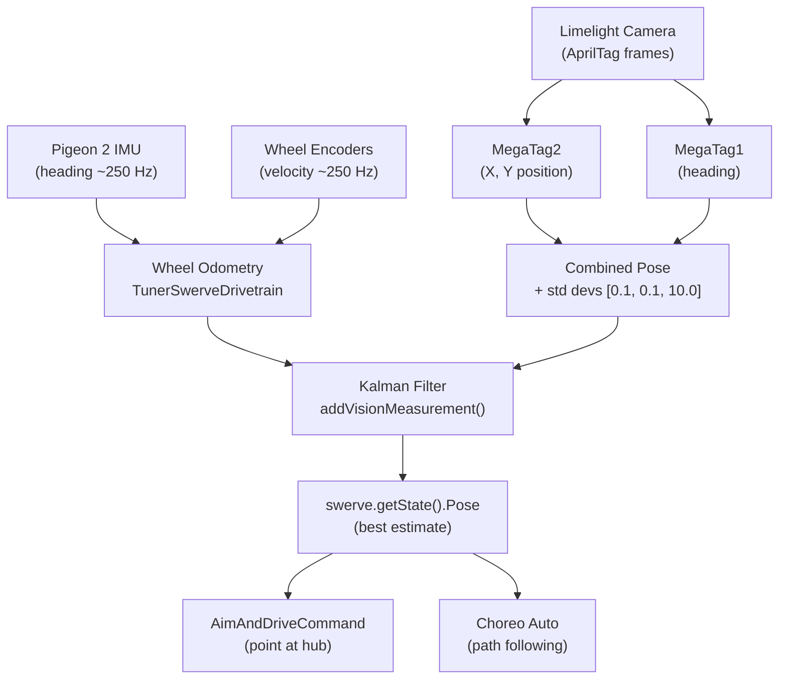

# Overview

Wayne HS 10411 Rufus 

[Google Doc Notes](https://docs.google.com/document/d/1e-II6_diUCd73_c5pIJWgDAT_IvrZXD0227dueINiO4/edit) <-- Log what you do here


# 2026CompetitiveConcept

This repository contains the code used for the WestCoast Products 2026 [Competitive Concept](https://wcproducts.com/pages/wcp-competitive-concepts).

The project is based on one of CTRE's [Phoenix 6 example projects](https://github.com/CrossTheRoadElec/Phoenix6-Examples/tree/main/java/SwerveWithChoreo). It uses WPILib [command-based programming](https://docs.wpilib.org/en/stable/docs/software/commandbased/what-is-command-based.html) to manage robot subsystems and actions, a [Limelight](https://limelightvision.io/) for vision, and [Choreo](https://choreo.autos/) for autonomous path following.

## Driver Controls (Xbox Controller — port 0)

### Driving
| Input | Action |
|---|---|
| Left Stick | Translate |
| Right Stick X | Rotate |
| A | Lock heading toward opponent alliance wall (180°) |
| B | Lock heading right (90° clockwise) |
| X | Lock heading left (90° counter-clockwise) |
| Y | Lock heading toward own alliance wall (0°) |
| Back | Re-zero field-centric orientation to current robot heading |

> **Field Centric toggle:** A **"Field Centric"** boolean in Elastic (SmartDashboard key `Field Centric`) switches drive mode. Default is **on** (field-centric). When turned off, the robot drives relative to its own front — useful for precise close-range maneuvers. Heading-lock (A/B/X/Y) is only active in field-centric mode.

### Shooting
| Input | Action |
|---|---|
| Right Trigger | Auto-aim at hub using Limelight, spin up shooter, feed when aimed and ready |
| Right Bumper | Spin up shooter to dashboard RPM (default 5000), feed once above 3500 RPM |

> **Right Trigger vs Right Bumper:** Right trigger requires a valid Limelight target lock before feeding. Right bumper shoots without vision — use this when the Limelight has no target or for close shots.

### Intake
| Input | Action |
|---|---|
| Left Trigger | Deploy intake pivot and run rollers (hold to intake) |
| Left Bumper | Stow intake pivot |
| Start | Chase visible fuel — steer toward largest fuel cluster using Limelight + run intake (hold) |

### Climbing
| Input | Action |
|---|---|
| D-Pad Up | Extend climber (hold); release to stop |
| D-Pad Down | Retract climber (hold); release to stop |

### Troubleshooting
| Input | Action |
|---|---|
| D-Pad Left | Reverse floor and shooter to clear a jam (hold) |
| Right Stick Click | Toggle force field on/off |

---

## Force Field Library (git subtree)

The `refinery-forcefield/` directory is a **git subtree** of the [BioNanomics/refinery-forcefield](https://github.com/BioNanomics/refinery-forcefield) library. It provides wall repulsion, snap-to zones, and a visual preset editor. The Gradle composite build (`includeBuild`) resolves the library at compile time — no JAR publishing or version management needed.

See [refinery-forcefield/README.md](refinery-forcefield/README.md) for charge types, tuning, and the web editor.

### Updating the library

```bash
./scripts/update-forcefield.sh
```

This runs `git subtree pull` to merge the latest upstream changes into this repo.

### Pushing changes back upstream

If you edit files inside `refinery-forcefield/` directly in this repo and want to push them back to the library:

```bash
git subtree push --prefix=refinery-forcefield forcefield main
```

### First-time setup (after a fresh clone)

New clones need to add the `forcefield` remote:

```bash
git remote add forcefield https://github.com/BioNanomics/refinery-forcefield.git
```

The subtree files are already committed in the repo — no submodule init required.

---

## Teleop Mode Setup

Use this checklist to get the robot ready for driver-controlled (teleop) mode.

### Every time you enable teleop

1. **Connect** — Laptop/driver station on the robot network; Xbox controller in port 0.
2. **Enable** — In the Driver Station app, select **Teleop** and enable the robot. On **first enable** after power-up, intake and hanger homing run automatically (retract to hard stop, zero encoders, then move to ready positions). Wait for homing to finish before driving.
3. **Re-zero heading** — With the robot placed on the field (front pointed where you want “forward”), press **Back** on the Xbox controller so field-centric drive matches the robot’s actual orientation.
4. **Drive** — Left stick = translate, Right stick X = rotate. Field-centric is on by default; toggle via Elastic (`Field Centric` key) if needed.

### Before your first match at an event

- **Upload AprilTag field map** to the Limelight (see [Field Setup](#field-setup--match-calibration) step 1).
- **Re-zero with Back** after placing the robot in the starting position.

### Optional / as needed

- **Shooter RPM** — Adjust via Shuffleboard “Target RPM” (default 5000) for Right Bumper manual shots.
- **Vision check** — In Shuffleboard or AdvantageScope, confirm `limelight/Estimated Robot Pose` (or AdvantageKit Limelight pose) is updating when tags are visible.
- **Force field** — Right stick click toggles wall repulsion on/off.

Driver control reference: [Driver Controls (Xbox Controller)](#driver-controls-xbox-controller--port-0) above.

---

## Field Setup & Match Calibration

Complete these steps **at every new event** (and after any camera or robot mechanical changes) before going on the field.

### 1. Upload the AprilTag Field Map to the Limelight

> Do this once per event — not before every match.

1. Connect a laptop to the robot's network (robot on, roboRIO booted).
2. Open the Limelight web UI: **http://limelight.local:5801** (or **http://10.104.11.11:5801** if mDNS isn't working).
3. Go to **Settings → AprilTag Field Map**.
4. Upload the correct JSON from the [`limelight-config/`](limelight-config/) folder:
   - **Most events (district, regional):** `2026-rebuilt-welded.json`
   - **If the event specifies AndyMark field parts:** `2026-rebuilt-andymark.json`
5. Confirm the active pipeline is set to **AprilTag** mode.

### 2. Set Up the Fuel Detector Pipeline

> Do this **once** (new camera, new season, or reflash). Not required before every event.

The robot uses two Limelight pipelines:

| Pipeline index | Type | Purpose |
|---|---|---|
| **0** | AprilTag | Field-relative pose estimation (localization) |
| **1** | Neural Detector | Fuel game-piece detection for the Start-button chase command |

#### 2a. Update Limelight OS to 2026.0+

The 2026 Hailo model flow requires **Limelight OS 2026.0 or newer**. Check the firmware version in the web UI under **Settings → System**. If it is older, download the latest image from the [Limelight downloads page](https://docs.limelightvision.io/docs/resources/downloads) and reflash.

#### 2b. Download the Fuel model and labels

From the [Limelight downloads page](https://docs.limelightvision.io/docs/resources/downloads), download:

- **Fuel B1 Model — HAILO 8 MONOCHROME** (or **HAILO 8L MONOCHROME** — match the accelerator in your unit)
- **Fuel Labels**

#### 2c. Create pipeline 1 as a Neural Detector

1. In the Limelight web UI, click **+** to add a new pipeline (or select slot 1 if it already exists).
2. Set **Pipeline Type** to **Neural Detector**.
3. Upload the model file and the labels file you downloaded.
4. Set the **Runtime** to **Hailo 8** or **Hailo 8L** to match your hardware.
5. Set **Confidence Threshold** to **0.55** as a starting point (lower finds more pieces; higher reduces false positives).

#### 2d. Set a crop window

Crop out regions that can never contain fuel to reduce false positives and improve speed:
- Bottom of frame: your own bumper/intake
- Top of frame: ceiling, bleachers, alliance wall

Drag the crop handles in the Neural Detector pipeline editor to exclude these areas.

#### 2e. Verify the pipeline index

With the robot running, confirm in the web UI that:
- **Pipeline 0** is your AprilTag pipeline (the robot uses this by default and returns to it after chasing).
- **Pipeline 1** is the Neural Detector / Fuel pipeline.

Robot code switches between them automatically — pipeline 0 is active at all times except while the driver holds **Start**.

#### 2f. Camera exposure for moving game pieces

In the Neural Detector pipeline camera settings:
- Use **low exposure** to reduce motion blur on rolling fuel.
- Raise **gain** just enough to keep detections stable in the venue lighting.
- You are not trying to produce a clear video — stable detections during robot motion are the goal.

### 3. Verify Camera Pose (Robot-to-Camera Transform)

The Limelight needs to know where it is mounted on the robot to produce accurate field-relative pose estimates.

1. In the Limelight web UI, go to **Settings → Robot Offset** (or the 3D tab depending on firmware version).
2. Enter the camera's position and angle relative to the center of the robot:
   - **Forward (X):** distance the camera is in front of robot center (meters, positive = forward)
   - **Side (Y):** distance left/right of robot center (meters, positive = left)
   - **Up (Z):** height above the floor (meters)
   - **Roll / Pitch / Yaw:** camera tilt angles (degrees)
3. Measure these from the robot physically if they haven't been set — they must match the actual mount.

### 4. Re-Zero Field-Centric Orientation Before Each Match

At the start of every match (robot placed on the field):

1. Point the **front of the robot** toward the driver station wall (or align as required by your starting position).
2. Press **Back** on the Xbox controller to re-zero field-centric orientation to the robot's current heading.

> The robot uses field-centric driving relative to this zero, so this must match how the robot is physically placed.

### 5. Verify Vision Is Working (Pre-Match Check)

1. Open **Shuffleboard** or **AdvantageScope** while connected to the robot.
2. Confirm vision data is updating:
   - **Shuffleboard:** check `SmartDashboard/limelight/Estimated Robot Pose`
   - **AdvantageScope (live or from log):** check `/AdvantageKit/Limelight/EstimatedPose` and `/AdvantageKit/Limelight/MeasurementAccepted`
3. If the pose is wildly wrong or not updating:
   - Check that the Limelight has a tag in view (run a test with tags visible).
   - Re-confirm the field map was uploaded and the correct pipeline is active.
   - Check that the camera pose offset is configured correctly.

### 6. Shooter Tuning (If Needed)

- The target shooter RPM for manual shots (Right Bumper) is set via **Shuffleboard** — look for the `Target RPM` slider under the Shooter subsystem widget.
- Default is **5000 RPM**. Adjust based on shot distance for the event venue.
- Feed threshold is fixed at **3500 RPM** — the floor and feeder will not run until the shooter crosses this.

---

## Power-Up Initialization

When the robot is powered on and robot code starts, several automatic initialization steps occur before the robot is ready to operate. Understanding this sequence helps diagnose issues and know what to expect when enabling the robot.

> **If you change any of this behavior in code, update this section.**
> Links back here are in the relevant source files:
> - `RobotContainer.java` — `configureBindings()` (homing trigger)
> - `Intake.java` — `homingCommand()`
> - `Hanger.java` — `homingCommand()`

### 1. On Code Start (Robot Constructor)

These happen immediately when the robot code launches, before any mode is active:

| What | Detail |
|---|---|
| AdvantageKit logging | Starts writing `.wpilog` to `/home/lvuser/logs/` and publishing live via NT4 |
| Brownout protection | RoboRIO brownout threshold set to **6.1 V** |
| Subsystems initialized | All subsystems (Swerve, Intake, Floor, Feeder, Shooter, Hood, Hanger, Limelight) are instantiated and their motors configured |
| Vision update begins | Limelight default command starts running immediately, even while disabled (`ignoringDisable = true`) |
| Shooter default command | Shooter default is `stop()` — motors hold at zero until commanded |

### 2. On First Enable (Teleop or Autonomous — not Test Mode)

When the robot transitions into **teleop or autonomous** for the first time after power-up, two homing sequences run automatically and in parallel. They are suppressed in **test mode**.

#### Intake Pivot Homing

The intake pivot motor has no absolute encoder, so its zero position must be found by driving it to a physical hard stop.

1. Pivot motor drives **outward at 10% output** (toward the hard stop).
2. Code waits until **supply current exceeds 6 A** — this indicates the pivot has stalled against the hard stop.
3. Encoder is **zeroed** at the hard stop position (`HOMED` = 110°).
4. Pivot immediately moves to **`STOWED` position (100°)**.

> This command uses `kCancelIncoming` — it cannot be interrupted once started. A subsequent position command will be queued until homing finishes.

#### Hanger Homing

The hanger motor also uses a hard-stop current-sensing approach.

1. Hanger motor drives **inward (retract) at −5% output**.
2. Code waits until **supply current exceeds 0.4 A** — indicating the hanger has bottomed out.
3. Encoder is **zeroed** at the retracted position (`HOMED` = 0 inches extension).
4. Hanger immediately extends to the **`EXTEND_HOPPER` position (2 inches)** — clear of the robot chassis.

> This command uses `kCancelSelf` — any position command issued during homing will cancel the homing sequence.

### 3. Field-Centric Drive Zero

The swerve drive uses field-centric control relative to a stored heading. This heading is **not automatically reset on power-up** — it must be manually re-zeroed by the driver before each match using the **Back button** on the Xbox controller (see [Re-Zero Field-Centric Orientation](#3-re-zero-field-centric-orientation-before-each-match)).

> `seedFieldCentric()` is suppressed in test mode to avoid affecting other test sequences.
---

## How the Robot Knows Its Position on the Field

Rufus maintains a continuous field-relative pose (X, Y, heading) by fusing two sources: **wheel odometry** and **Limelight vision**. These are merged via a Kalman filter built into CTRE's `SwerveDrivetrain` base class.

### 1. Wheel Odometry (always running)

The CTRE [`TunerSwerveDrivetrain`](src/main/java/frc/robot/generated/TunerConstants.java) tracks the robot's position by integrating wheel encoder velocities and gyroscope (Pigeon 2 IMU) heading at a high rate (~250 Hz). This is reliable over short distances but accumulates drift over time.

The current estimated pose is available at any time via `swerve.getState().Pose`. It is used throughout the robot — for example, [`AimAndDriveCommand`](src/main/java/frc/robot/commands/AimAndDriveCommand.java) uses it to compute the angle from the robot to the hub on every cycle.

### 2. Limelight AprilTag Vision (fused continuously)

The [`Limelight`](src/main/java/frc/robot/subsystems/Limelight.java) subsystem reads AprilTag detections from the camera and returns a field-relative pose estimate using **MegaTag2** (position) and **MegaTag1** (heading):

| Source | Used for | Why |
|---|---|---|
| MegaTag2 | X / Y translation | More position-stable; uses IMU heading to resolve tag ambiguity |
| MegaTag1 | Rotation (heading) | Helps counteract IMU drift over a match |

The combined pose is published in two places every cycle:
- `SmartDashboard/limelight/Estimated Robot Pose` — for Shuffleboard diagnostics
- `/AdvantageKit/Limelight/EstimatedPose` — in the `.wpilog` for post-match replay in AdvantageScope

Additional signals logged to `/AdvantageKit/Limelight/`: `TagCount`, `LatencyMs`, `AvgTagDistMeters`, `MeasurementAccepted` (false when no tags visible).

Standard deviations passed with each vision measurement are `[0.1 m, 0.1 m, 10.0 rad]` — the filter trusts X/Y position strongly but is skeptical of heading from vision, since the gyro is generally more reliable for rotation.

### 3. Kalman Filter Fusion

[`RobotContainer.updateVisionCommand()`](src/main/java/frc/robot/RobotContainer.java#L141) runs as the Limelight's default command on **every periodic cycle, even while disabled** (`ignoringDisable = true`). Each cycle it:

1. Gets the current best pose from the swerve state.
2. Sends it to the Limelight (so MegaTag2 can use the IMU heading for tag disambiguation).
3. If a valid pose estimate is returned (at least one tag visible), calls [`swerve.addVisionMeasurement()`](src/main/java/frc/robot/subsystems/Swerve.java#L149) to feed the fix into the Kalman filter with its standard deviations.

The filter automatically weights odometry vs. vision based on the respective standard deviations. If no tags are visible, the robot continues relying on odometry alone.

### 4. How It Is Used

- **Auto-aim ([`AimAndDriveCommand`](src/main/java/frc/robot/commands/AimAndDriveCommand.java)):** Computes the direction from `swerve.getState().Pose` to `Landmarks.hubPosition()` and rotates the robot to point its shooter at the hub.
- **Autonomous ([`AutoRoutines`](src/main/java/frc/robot/commands/AutoRoutines.java)):** Choreo path following uses the fused pose to run PID corrections in [`Swerve.followPath()`](src/main/java/frc/robot/subsystems/Swerve.java#L98), keeping the robot on the planned trajectory.
- **Diagnostics:** The live estimated pose and all subsystem state is visible in AdvantageScope at `/AdvantageKit/…` whenever connected to the robot or when replaying a `.wpilog` log file. Swerve pose (`Swerve/Pose`) and vision (`Limelight/EstimatedPose`) are both captured in the log for full post-match replay.



---

## Autonomous Routines

The active auto routine is selected in **Elastic** before the match using the **Auto Chooser** widget. The robot runs the selected routine automatically when autonomous mode starts.

### Setting Up the Auto Chooser Widget in Elastic

> Do this once after first connecting to the robot with Elastic. The layout is saved and reloads automatically on future connections.

1. **Connect** your laptop to the robot network and open **Elastic**.
2. **Enable editing** — click the pencil / edit icon in Elastic's toolbar.
3. **Add a new widget** — click **+** (Add Widget) or drag from the widget palette.
4. Choose **ComboBox Chooser** (or **Split Button Chooser** if you prefer large buttons).
5. Set the **NT Key** / source to:
   ```
   SmartDashboard/Auto Chooser
   ```
6. Give it a clear label such as **Auto Routine**.
7. **Disable editing** and save the layout.

The chooser will now show all registered routines as a dropdown. The selection takes effect immediately — no need to restart code. Always confirm the correct routine is selected **before autonomous starts**.

> **If the widget shows "No options" or is blank:** the robot code is not running yet, or the robot is not connected. Enable the robot (or just power it on with code running) and the options will populate automatically.

---

### Available Routines

| Routine | Starting Position | Description |
|---|---|---|
| **Shoot Only** | Any | Aims at the hub and shoots preloaded balls (5 s timeout). No driving — safe fallback for any starting spot. |
| **Back Up Left and Shoot** | Left (north) zone | Starts from left; backs up at an angle (Choreo path), then aims and shoots. Requires Choreo trajectory — see below. |
| **Back Up Right and Shoot** | Right (south) zone | Starts from right; backs up at an angle (Choreo path), then aims and shoots. Requires Choreo trajectory — see below. |
| **Shoot and Climb — Right** | Right (south) zone | Shoots preloaded balls, then drives to the tower and climbs. |
| **Shoot and Climb — Center** | Center zone | Shoots preloaded balls, then drives to the tower and climbs. |
| **Shoot and Climb — Left** | Left (north) zone | Shoots preloaded balls, then drives to the tower and climbs. |
| **Outpost and Depot** | Right (south) zone | Drives to the outpost, collects from the depot, shoots, then climbs. |

> **Picking the right routine:** Match the routine to where the robot is physically placed. Left/Center/Right are from **your driver's perspective** facing the field — this is the same whether you are Blue or Red alliance. Using the wrong position will cause the odometry reset to be off and the robot will miss the tower.

### Red Alliance — Automatic Mirroring

All trajectories are programmed in Blue alliance coordinates. When the FMS assigns the robot to Red alliance, **ChoreoLib automatically mirrors every trajectory** across the field centerline — no separate Red routines are needed and no code changes are required.

Auto-aim also works correctly on Red: [`Landmarks.hubPosition()`](src/main/java/frc/robot/Landmarks.java) returns the Red alliance hub coordinates when on Red.

**The driver picks the same routine name (Left / Center / Right) regardless of alliance color.**

> **Important:** This mirroring depends on the FMS (or Driver Station in practice mode) correctly reporting the alliance color **before** autonomous starts. At events, verify the Driver Station shows the correct alliance color on the status bar before each match. In practice mode on a laptop, set the alliance manually in the Driver Station app under the **Setup** tab.

### Shoot and Climb — Sequence Detail

1. Odometry is reset to the robot's known starting pose.
2. `aimAndShoot()` runs — shooter spins up, robot rotates to point shooter at hub, feeds when aimed and at speed. Times out after 5 seconds.
3. Robot drives directly to the tower (~2.1 s, ~4 m diagonal).
4. Hanger begins raising to pre-hang position (`HANGING`) while driving.
5. On arrival at the tower, hanger pulls down to fully climbed position (`HUNG`).

> The trajectory file for this path is [`ShootAndClimbTrajectory.traj`](src/main/deploy/choreo/ShootAndClimbTrajectory.traj). It was generated as a straight-line trapezoidal profile. **If there are field obstacles on the diagonal path, open it in Choreo, re-solve, and save — the robot code will automatically use the updated path on next deploy.**

### Back Up Left / Back Up Right and Shoot — Choreo setup

These routines start from the **left** or **right** zone (same as Shoot and Climb), **back up at an angle**, and **end with the robot tilted so the shooter faces the hub**. Create the two trajectories in Choreo once:

1. Open **Choreo** and load `src/main/deploy/choreo/ChoreoProject.chor`.
2. **Back Up Left:** New Trajectory, name **`BackUpLeftTrajectory`**. **Start from left zone:** (3.598 m, 7.432 m, 180°). **End:** (2.1 m, 6.8 m) with **heading so the shooter (back) points at the hub** — set end waypoint heading to point the back of the robot at the speaker (~130°). Generate, then Save.
3. **Back Up Right:** New Trajectory, name **`BackUpRightTrajectory`**. **Start from right zone:** (3.598 m, 0.640 m, 180°). **End:** (2.1 m, 1.2 m) with **heading tilted toward the hub** (~227°). Generate and Save.
4. Ensure the `.traj` files are in `src/main/deploy/choreo/`, then build and deploy.

[`BackUpAndShootTraj.java`](src/main/java/frc/robot/generated/BackUpAndShootTraj.java) uses the same left/right start poses as Shoot and Climb and computes end headings so the path finishes aimed at the speaker; you can tweak end (x, y) or duration there.

### Adding or Editing a Routine

1. Edit the trajectory in Choreo (see [Choreo Setup](#choreo-setup-and-trajectory-editing) below).
2. Export the `.traj` file to `src/main/deploy/choreo/`.
3. Add a `ChoreoTraj` constant to [`ChoreoTraj.java`](src/main/java/frc/robot/generated/ChoreoTraj.java) matching the trajectory name and times.
4. Add a new `private AutoRoutine yourRoutine()` method in [`AutoRoutines.java`](src/main/java/frc/robot/commands/AutoRoutines.java) following the existing pattern.
5. Register it in `configure()` with `autoChooser.addRoutine("Your Name", this::yourRoutine)`.
6. Build and deploy.

---

## Choreo Setup and Trajectory Editing

[Choreo](https://choreo.autos/) is the path planning tool used to design and export robot trajectories. Install it on any laptop used for drive team or development work.

### Installation

**macOS:**
Download the `.dmg` from the [Choreo GitHub releases page](https://github.com/SleipnirGroup/Choreo/releases). Open the `.dmg` and drag Choreo to your Applications folder.

**Windows:**
Download the `.exe` installer from [choreo.autos](https://choreo.autos/) and run it. No admin rights required.

**Linux:**
Download the `.AppImage` or `.deb` from the releases page on [choreo.autos](https://choreo.autos/).

### Opening the Project

1. Launch Choreo.
2. Open the project file: `src/main/deploy/choreo/ChoreoProject.chor`.
3. All trajectories in the project will appear in the left sidebar.

### Editing a Trajectory

1. Click a trajectory in the sidebar to open it on the field map.
2. Drag waypoints to adjust the path. Add waypoints with a double-click on the field.
3. Add **constraints** (max velocity, stop points, keep-in-lane) via the constraints panel to shape how the robot moves through a segment.
4. Click **Generate** (or press `Ctrl+Enter` / `Cmd+Enter`) to re-solve the optimized trajectory.
5. Save the project — Choreo automatically writes the updated `.traj` file to the `choreo/` folder alongside the `.chor` file.
6. The updated trajectory is picked up automatically on the next `./gradlew deploy`.

> **Do not manually edit `.traj` files** — they are generated output. Edit waypoints in Choreo and regenerate.

### Adding a New Trajectory

1. Click **New Trajectory** in Choreo.
2. Place your start and end waypoints on the field map.
3. Generate the path.
4. Save — Choreo writes a new `.traj` file to the `choreo/` folder.
5. Follow the [Adding or Editing a Routine](#adding-or-editing-a-routine) steps above to wire it into Java.