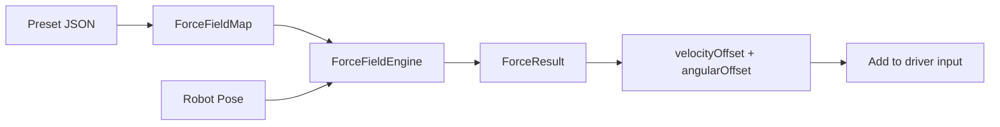

# Refinery ForceField

**Potential-field driving assist for FRC swerve robots.**

ForceField lets you place invisible charges on the field — walls that repel, sweet spots that attract — and the library converts them into real-time velocity offsets that blend with the driver's joystick input. The robot steers itself away from obstacles and toward scoring positions without taking control away from the driver.

> Part of **The REFINERY** by [BioNanomics](https://github.com/BioNanomics) — tools and libraries for FRC teams.

## Coordinate System

ForceField uses the **WPILib standard coordinate system**, which is shared by all major FRC tools:

| Property | Convention |
|----------|------------|
| **Origin** | Blue alliance corner (bottom-left viewed from above) |
| **+X** | Toward red alliance wall (down-field) |
| **+Y** | Toward far side wall (cross-field) |
| **Rotation** | Counter-clockwise positive, 0° = toward +X |
| **Units** | Meters, radians |

This is the same coordinate system used by:

- **[WPILib](https://docs.wpilib.org/en/stable/docs/software/basic-programming/coordinate-system.html)** — the standard FRC framework ("Always Blue Origin")
- **[Choreo](https://choreo.autos)** — trajectory optimization tool by SleipnirGroup
- **[PathPlanner](https://pathplanner.dev)** — path planning and auto builder by mjansen4857

All three tools define paths and positions in blue-origin coordinates and flip at runtime for the red alliance. Charges placed in the ForceField editor use the same coordinates — no conversion is needed.

### Field Dimensions by Year

Field dimensions vary slightly between seasons. The editor loads calibrated dimensions from [WPILib's field image metadata](https://github.com/wpilibsuite/allwpilib/tree/main/fieldImages/src/main/native/resources/edu/wpi/first/fields):

| Year | Game | Width (m) | Height (m) | Source |
|------|------|-----------|------------|--------|
| 2026 | REBUILT | 16.541 | 8.069 | `2026-rebuilt.json` |
| 2025 | REEFSCAPE | 17.548 | 8.052 | `2025-reefscape.json` |
| 2024 | Crescendo | 16.542 | 8.211 | `2024-crescendo.json` |
| 2023 | Charged Up | 16.542 | 8.014 | `2023-chargedup.json` |

> **Note:** The 2025 REEFSCAPE field is wider than other years due to its game-specific layout. The editor adapts automatically when you switch field years.

## How It Works



The engine evaluates forces at each of the robot's four swerve module corners independently. This naturally produces both translational and rotational effects:

- A **wall parallel** to the robot → uniform repulsion (pure translation)
- A **wall at an angle** → stronger force on the nearer corner → torque pivots the robot away
- An **attractor off to one side** → pulls that corner harder → robot rotates to face it

Forces are converted to velocity offsets (m/s) and angular velocity offsets (rad/s) that are **added** to the driver's joystick commands. The driver always has authority — they can push through the force field if needed.

## Charge Types

| Type | Description | Key Parameters |
|------|-------------|----------------|
| **PointCharge** | Attracts or repels from a single location | `x`, `y`, `strength`, `falloff` (gaussian / inverse_square / inverse_linear), `sigma` |
| **LineCharge** | Attracts or repels perpendicular to a line segment (great for walls) | `x1`, `y1`, `x2`, `y2`, `strength`, `falloffDistance` |
| **RadialZone** | Constant force inside an inner radius, linear ramp to outer radius | `x`, `y`, `innerRadius`, `outerRadius`, `strength` |

**Strength convention:** positive = attractive (pulls toward), negative = repulsive (pushes away).

## Quick Start (Java)

### 1. Add the dependency

**Option A — Composite build** (for development, or if this repo is a subdirectory):

```gradle
// settings.gradle
includeBuild 'refinery-forcefield'

// build.gradle
dependencies {
    implementation 'com.bionanomics.refinery:refinery-forcefield'
}
```

**Option B — JitPack** (once published to GitHub):

```gradle
// settings.gradle
dependencyResolutionManagement {
    repositories {
        maven { url 'https://jitpack.io' }
    }
}

// build.gradle
dependencies {
    implementation 'com.github.BioNanomics:refinery-forcefield:v0.1.0'
}
```

### 2. Create a preset JSON file

Place your preset(s) in `src/main/deploy/forcefield/`. Here's a minimal example:

```json
{
  "name": "My Field",
  "maxForceVelocity": 2.0,
  "maxForceTorque": 1.5,
  "forceGain": 1.0,
  "torqueGain": 0.5,
  "charges": [
    {
      "type": "line",
      "id": "wall_south",
      "x1": 0.0, "y1": 0.0,
      "x2": 16.54, "y2": 0.0,
      "strength": -3.0,
      "falloffDistance": 1.0
    },
    {
      "type": "point",
      "id": "scoring_spot",
      "x": 5.5, "y": 4.0,
      "strength": 2.0,
      "falloff": "gaussian",
      "sigma": 0.8
    }
  ]
}
```

### 3. Wire it up in robot code

```java
import com.bionanomics.refinery.forcefield.*;
import edu.wpi.first.math.geometry.Translation2d;

// Define your swerve module corner offsets [FL, FR, BL, BR]
Translation2d[] corners = new Translation2d[] {
    new Translation2d( 0.276,  0.257),  // Front Left
    new Translation2d( 0.276, -0.257),  // Front Right
    new Translation2d(-0.276,  0.257),  // Back Left
    new Translation2d(-0.276, -0.257),  // Back Right
};

// Load a preset and create the engine
ForceFieldMap map = ForceFieldMap.loadFromDeploy("default");
ForceFieldEngine engine = new ForceFieldEngine(map, corners);

// In your drive command's execute():
ForceResult result = engine.compute(drivetrain.getPose());

// Add the offsets to your driver's joystick input
ChassisSpeeds driverSpeeds = /* your joystick -> ChassisSpeeds */;
ChassisSpeeds combined = driverSpeeds.plus(
    new ChassisSpeeds(
        result.velocityOffset().getX(),
        result.velocityOffset().getY(),
        result.angularVelocityOffset()
    )
);
```

### 4. Optional: SmartDashboard preset switching

```java
// In RobotContainer constructor:
ForceFieldConfig ffConfig = new ForceFieldConfig(engine);

// In robotPeriodic():
ffConfig.update();
```

This adds a `SendableChooser` to SmartDashboard so you can switch presets on the fly. It also publishes live-tunable gains (`ForceField/ForceGain`, `ForceField/TorqueGain`, etc.).

## Quick Start (C++)

C++ headers and sources are provided under `src/main/native/`. Copy or include them in your project:

```
include/refinery/forcefield/ForceField.h    ← convenience header (includes all)
include/refinery/forcefield/Charge.h
include/refinery/forcefield/PointCharge.h
include/refinery/forcefield/LineCharge.h
include/refinery/forcefield/RadialZone.h
include/refinery/forcefield/ForceResult.h
include/refinery/forcefield/ForceFieldMap.h
include/refinery/forcefield/ForceFieldEngine.h
include/refinery/forcefield/FalloffType.h

cpp/PointCharge.cpp
cpp/LineCharge.cpp
cpp/RadialZone.cpp
cpp/ForceFieldMap.cpp
cpp/ForceFieldEngine.cpp
```

```cpp
#include <refinery/forcefield/ForceField.h>

using namespace refinery::forcefield;

// Load and compute
auto map = ForceFieldMap::LoadFromDeploy("default");
ForceFieldEngine engine{map, cornerOffsets};

auto result = engine.Compute(robotPose);
// result.velocityOffset, result.angularVelocityOffset, result.cornerForces
```

> **Note:** The C++ implementation uses WPILib C++ types (`frc::Translation2d`, `frc::Pose2d`, `wpi::json`). A native Gradle build is not yet configured — teams should integrate the sources into their existing C++ build.

## Preset JSON Schema

| Field | Type | Description |
|-------|------|-------------|
| `name` | string | Display name for the preset |
| `maxForceVelocity` | double | Maximum velocity offset magnitude (m/s) |
| `maxForceTorque` | double | Maximum angular velocity offset (rad/s) |
| `forceGain` | double | Multiplier applied to net translational force |
| `torqueGain` | double | Multiplier applied to net torque |
| `charges` | array | List of charge objects (see below) |

### Point charge

```json
{ "type": "point", "id": "name", "x": 0, "y": 0, "strength": 1.0, "falloff": "gaussian", "sigma": 0.8 }
```

- `falloff`: `"gaussian"`, `"inverse_square"`, or `"inverse_linear"`
- `sigma`: Width parameter (only used with `"gaussian"`)

### Line charge

```json
{ "type": "line", "id": "name", "x1": 0, "y1": 0, "x2": 1, "y2": 0, "strength": -3.0, "falloffDistance": 1.0 }
```

- Force acts perpendicular to the segment
- `falloffDistance`: Distance at which force drops to zero

### Radial zone

```json
{ "type": "radial", "id": "name", "x": 0, "y": 0, "innerRadius": 0.3, "outerRadius": 2.0, "strength": -2.0 }
```

- Full strength inside `innerRadius`
- Linear ramp from `innerRadius` to `outerRadius`
- Zero force beyond `outerRadius`

## Tuning Guide

| Parameter | Effect | Typical Range |
|-----------|--------|---------------|
| `forceGain` | How aggressively forces translate to velocity | 0.5 – 2.0 |
| `torqueGain` | How aggressively torque translates to rotation | 0.2 – 1.0 |
| `maxForceVelocity` | Caps the velocity offset so forces can't overpower the driver | 1.0 – 3.0 m/s |
| `maxForceTorque` | Caps the angular velocity offset | 0.5 – 2.0 rad/s |
| `strength` | Individual charge strength (negative = repel, positive = attract) | ±1.0 – ±5.0 |
| `falloffDistance` | (Line) Distance from line where force reaches zero | 0.5 – 2.0 m |
| `sigma` | (Point, gaussian) Width of the Gaussian bell curve | 0.3 – 2.0 m |

Start with low gains (0.5 / 0.3) and increase until the robot responds without feeling jerky. Use the SmartDashboard live-tuning to adjust without redeploying.

## Architecture

```
com.bionanomics.refinery.forcefield
├── Charge.java              # Interface: evaluate(point) → force vector
├── PointCharge.java          # Point source with gaussian/inverse falloff
├── LineCharge.java           # Line segment with perpendicular force
├── RadialZone.java           # Circular zone with inner/outer radii
├── FalloffType.java          # Enum: GAUSSIAN, INVERSE_SQUARE, INVERSE_LINEAR
├── ForceResult.java          # Record: velocityOffset, angularVelocityOffset, cornerForces
├── ForceFieldMap.java        # Loads JSON presets, evaluates net force at a point
├── ForceFieldEngine.java     # Evaluates at 4 corners, computes torque, clamps output
└── ForceFieldConfig.java     # SmartDashboard integration (preset chooser, live tuning)
```

**No AdvantageKit dependency.** The library is framework-agnostic. Log the `ForceResult` fields using whatever logging system your team prefers.

## Web Editor

A visual field editor is included in the `editor/` directory for designing and testing presets. Serve locally with:

```sh
cd editor && python3 -m http.server 8765
```

Then open [http://localhost:8765](http://localhost:8765).

Features:
- Drag-and-drop placement of point, line, and radial charges
- Real-time force arrow and heatmap visualization
- Robot preview overlay with swerve module corners
- Export/import JSON presets (same format used by `ForceFieldMap`)
- **Multi-year field images** — switch between FRC seasons via dropdown

### Adding a New Field Year

1. Download the field PNG and calibration JSON from [WPILib's field images](https://github.com/wpilibsuite/allwpilib/tree/main/fieldImages/src/main/native/resources/edu/wpi/first/fields)
2. Drop both files into `editor/fields/`
3. Add the JSON filename to `editor/fields/manifest.json`

The editor reads each WPILib JSON's `field-corners` and `field-size` to calibrate the image precisely to field coordinates — no manual pixel mapping needed.

## Requirements

- **Java 17+**
- **WPILib 2026.1.1** (wpimath, wpiunits, wpiutil, wpilibj)
- **Jackson 2.19.x** (included transitively via WPILib)

## License

[MIT](https://opensource.org/licenses/MIT)

---

*Built by FRC Team 10411 — Rufus*
